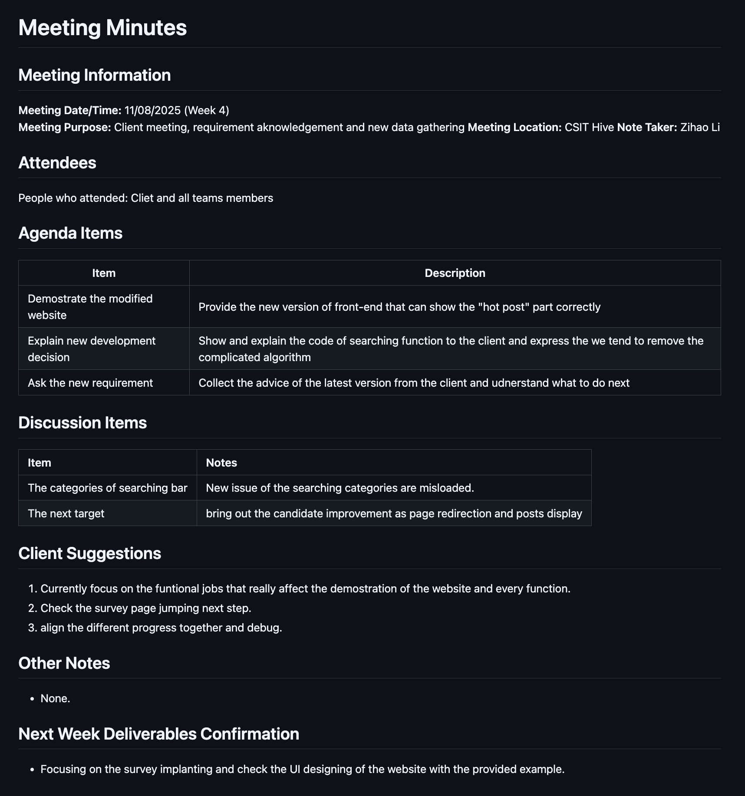
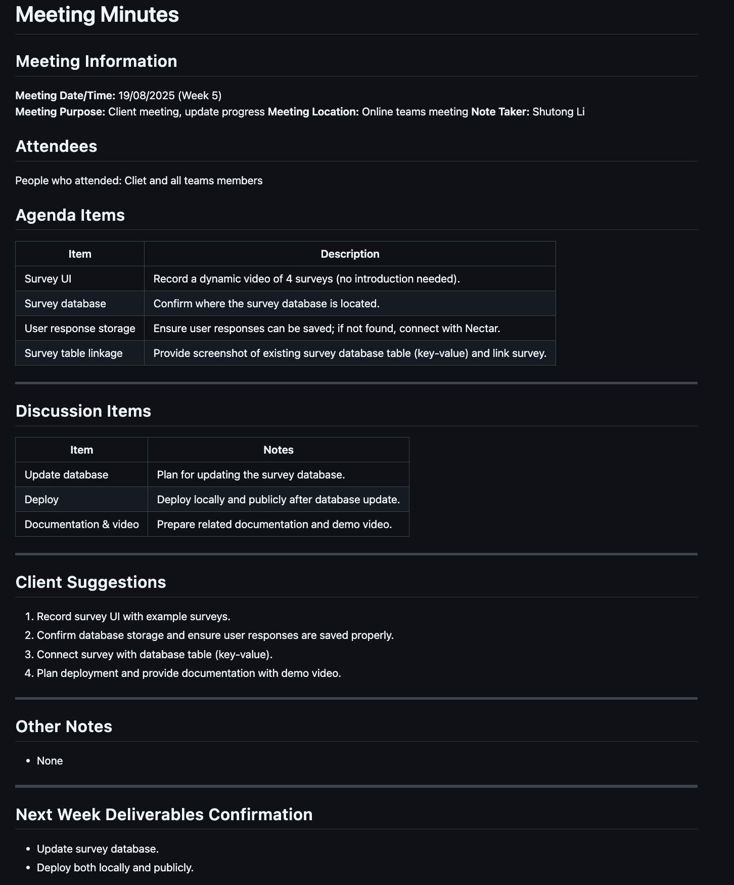
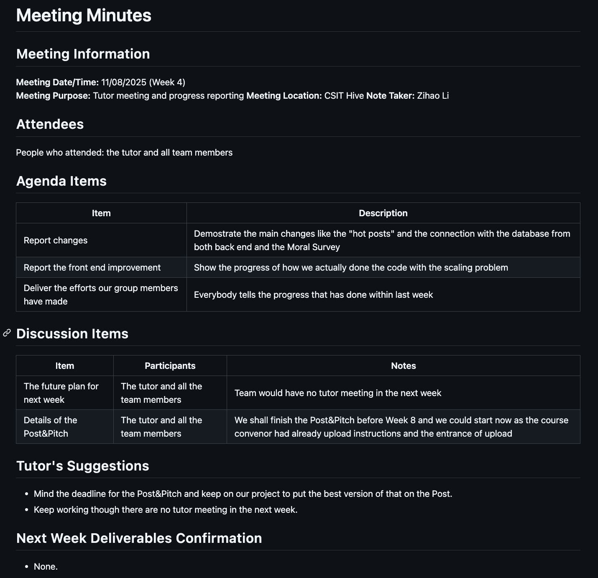

# Sprint 5 — Reflection & Improvement Report

**Timeframe:** Week 4–5 (11–24 Aug 2025)  
**Team:** Moral Decisions  
**Sprint Goal:** Stabilise the demo-critical user path (Homepage → Hot Posts / Search → Survey), fix high‑impact defects, and unify start‑up/ports so the system reliably runs locally and for demos.

---

## 1. Feedback Collected

### Client Meetings (11/08 & 19/08)
- Search categories are **misloaded/misaligned**; fix UI/UX defects that affect the demo the most.  
- Validate **page redirection** from homepage and the **posts display**.  
- Record a **UI video** that shows four surveys (no narration required).  
- Confirm where the **survey database** is located; ensure **user responses are saved**.  
- Connect surveys with the existing **key–value table** and plan **deployment + documentation**.

### Tutor Meeting (11/08)
- Mind the **Post & Pitch** deadline.  
- No tutor meeting in week 5—keep progress aligned and continue debugging.

---

## 2. What We Changed (This Sprint)

1. **Hot Post logic fixed** – list titles match the opened detail; front/back‑end contract aligned.  
2. **Search Bar improved** – dropdown now renders fully; **Enter** triggers search; basic keyboard accessibility added.  
3. **Survey start‑up ports unified** – consolidated env/compose/scripts so surveys start reliably without conflicts.  
4. **Homepage ↔ Survey routing wired** – the **Survey** button on the homepage now opens the surveys correctly.

---

## 3. Issues & Root Causes

- **Hot Post mismatch**: Inconsistent contract/field semantics between front‑end and back‑end;
- **Search dropdown cut‑off / no Enter**: Style/overflow issue plus missing keyboard event binding; keyboard UX not in the review checklist.  
- **Survey start‑up/port conflicts**: Env variables and port mappings spread across files;
- **Homepage Survey button inactive**: Router/link not connected to the service; 

---

## 4. Actions → PBIs / PRs

| Feedback item | PBI / PR | Owner | Definition of Done | Status |
|---|---|---|---|---|
| Hot Post title/detail consistency | Front/Back contract alignment; **PR FE #62** | FE/BE | 1:1 field mapping; 5/5 demo cases pass with screenshots | ✅ Done |
| Search dropdown completeness & Enter key | **PR FE #63** | FE | Dropdown fully visible; Enter submits; no console errors | ✅ Done |
| Unify Survey ports/start‑up | Scripts + `.env`/compose updates | DevOps | One‑command start works locally/containers; no port conflicts | ✅ Done |
| Homepage → Survey routing | Router/link fix | FE | Home button opens four surveys successfully | ✅ Done |
| Docs & demo video | Wiki/README + screen recording | Team | Video covering 4 surveys + local/public deployment steps | ⏳ In progress |

---

## 5. Outcomes & Evidence

- **User path restored**: Internal walk‑throughs show no blockers on Homepage → Hot Posts / Search → Survey.  
- **Defect closure**: Hot Post mismatch has not re‑appeared; search dropdown renders fully and Enter works as expected.  
- **Reproducible start‑up**: Unified ports and scripts—new environment can run
- **Stakeholder alignment**: next sprint will focus on (i) database update (new data + persistence), and (ii) a complete documentation pack (user manual, ops runbook, handover).

  
---

## 6. What Worked / What Didn’t

**Worked**  
- Tight loop from **minutes → PBI/PR → demo** closed high‑impact issues quickly.  
- “Small, high‑value fixes first” kept the demo path stable.

**Didn’t**  
- Fragmented env/ports increased troubleshooting time.  
- No automated regression for Hot Posts/Search; reliance on manual checks.

---

## 7. Improvement Commitments for Next Sprint
**Sprint Objective:** Ship a reliable database update (schema + migration + persistence) and deliver a complete, usable documentation pack (User Manual + Handover/Runbooks).  
**Capacity split:** DB 60% · Docs 40%.

### Database
- Finalise **Schema v2** (ERD + schema doc) — **DoD:** reviewed & approved.
- Implement **idempotent migrations + rollback + backup** — **DoD:** staging dry-run + restore succeed.
- Wire **survey persistence** and **key–value linkage** — **DoD:** CRUD + export work; integration tests green.
- Expose **API v2** and switch FE — **DoD:** e2e path passes on staging.

### Documentation
- **User Manual v1.0** (screenshots/FAQ) — **DoD:** a non-dev completes key tasks using the guide.
- **Operations Runbook** (envs/ports/start/stop/logs/backup/restore/secrets) — **DoD:** fresh-eyes local deploy ≤ 30 min.

### Milestones & Measures
- **Mid-sprint:** schema sign-off + migration dry-run ✅  
- **End-sprint:** API v2 + survey persistence on staging; docs pack complete ✅  
- **Metrics:** migration success **100%** (staging) ✅ 

### Risks (mitigation)
- Data loss during migration → Pre-migration backup + tested rollback; run on staging first; read-only window during cutover.
- FE–BE contract drift → OpenAPI v2 as single source of truth; FE types generated from spec; contract test in CI.
- Environment parity issues → One-click scripts for local/staging; .env templates checked into repo; port map documented.
- Documentation lag → “docs-before-merge” rule for schema/API PRs; fresh-eyes dry-run required before sprint close.

### Exit Criteria
Staging runs **DB v2**; homepage→survey e2e path green; docs pack published and validated by a fresh-eyes run.

