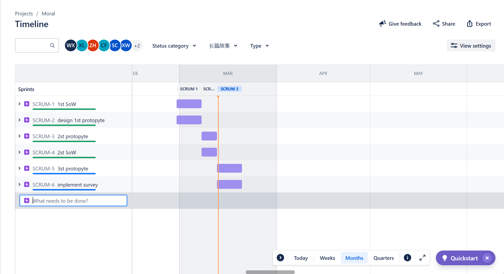
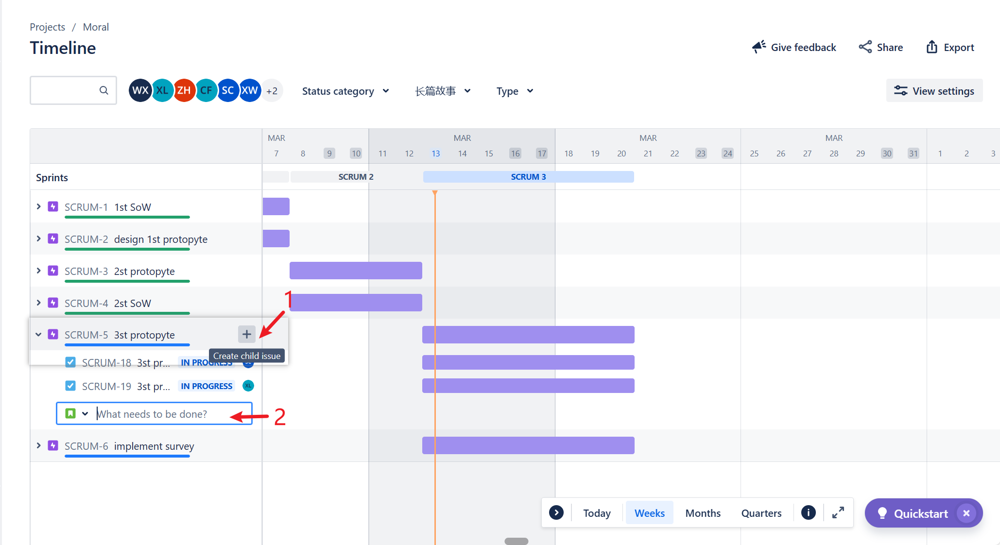
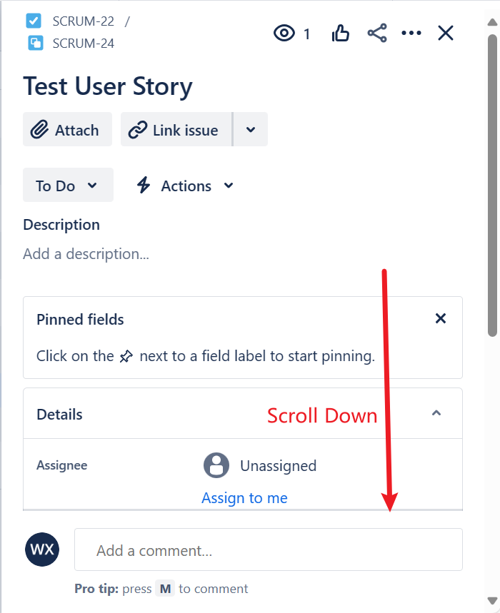
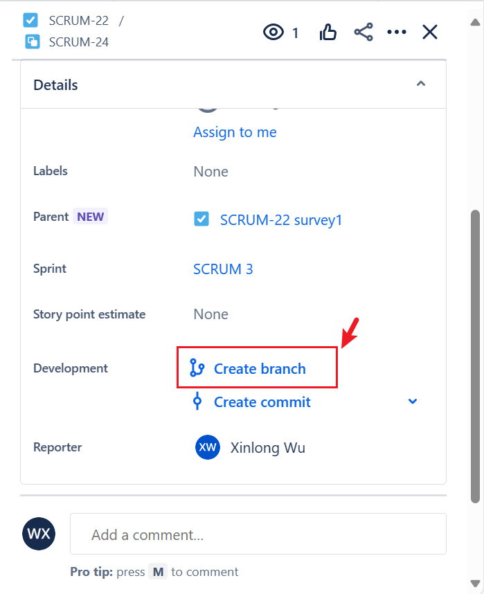
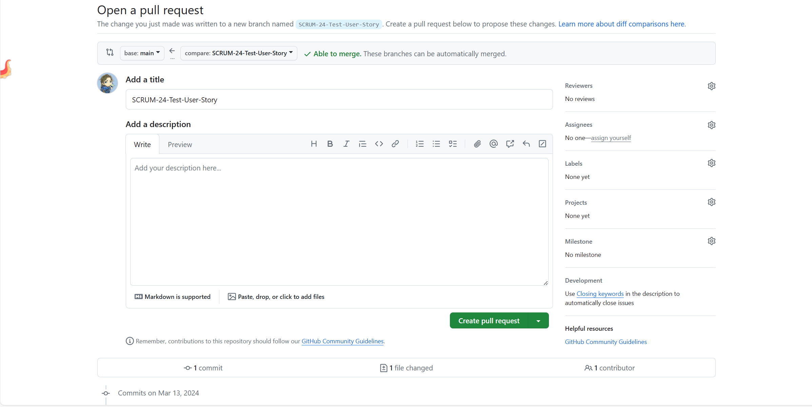
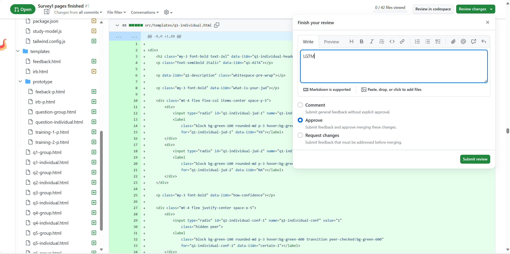

1. Create Task at Jira

2. Add more **user story** for each task, assign to yourself, for SCRUM Dev. (make the **user story** as a single task)

3. Create Branch for **User story**, **Note**: Please Keep branch name has prefix `SCRUM-*-`. That is the way Jira track the progress

4. Develping at Branch ....

5. Create PR to submit work

6. Waiting for CI Passed and at **least 3 other reviewers** accepted/LGTM
 - review code and add your comments if needed
 
 - if all good, **Approve this PR** 

7. Merge
